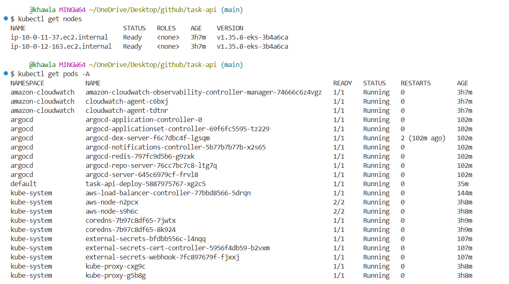
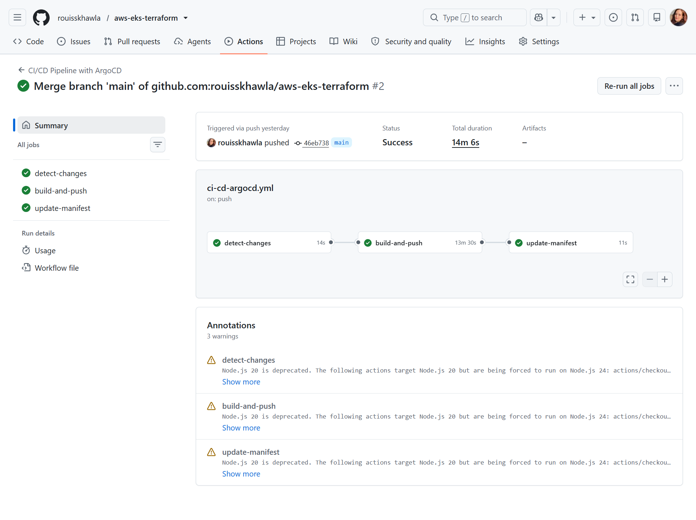
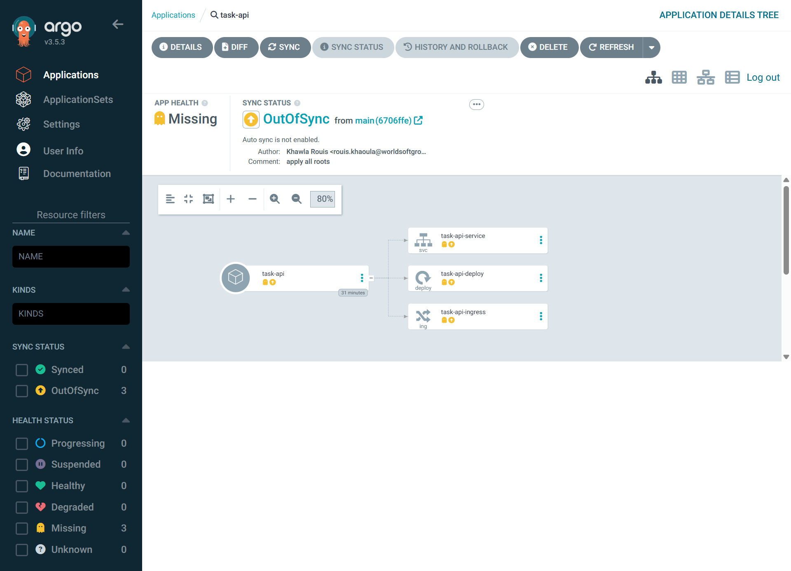
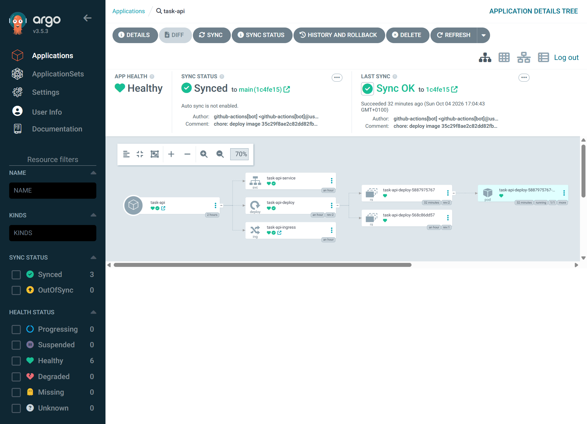
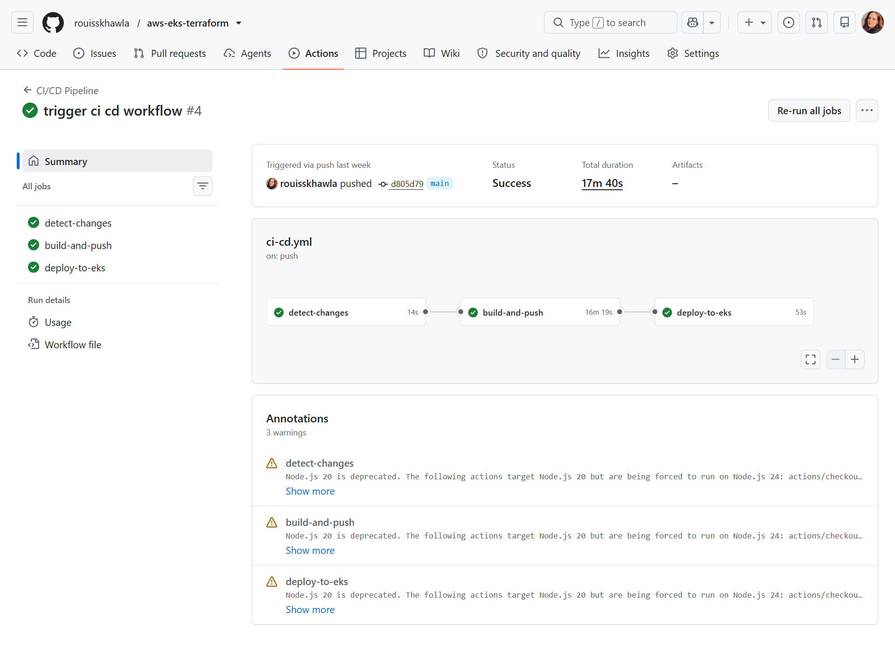

# AWS EKS Deployment, FastAPI Task API

A production style deployment of a small FastAPI CRUD API to Amazon EKS, built from scratch as a hands-on learning project: Terraform for infrastructure, GitOps via ArgoCD for deployment, GitHub Actions authenticating to AWS with OIDC (no long-lived keys), and CloudWatch for observability.

The goal was to build the real thing end to end, hit the real problems that only show up once infrastructure actually runs, and fix them properly.

## Workflows

[](https://github.com/rouisskhawla/aws-eks-terraform/actions/workflows/ci-cd.yml)
[](https://github.com/rouisskhawla/aws-eks-terraform/actions/workflows/ci-cd-argocd.yml)
[](https://github.com/rouisskhawla/aws-eks-terraform/actions/workflows/terraform.yml)
[](https://github.com/rouisskhawla/aws-eks-terraform/actions/workflows/terraform-destroy.yml)

For the full infrastructure architecture (all five Terraform state roots, apply/destroy order, IAM/IRSA authentication model, and the debugging lessons), see **[`terraform/README.md`](./terraform/README.md)**. This file covers the project as a whole: the app, both CI/CD paths, and how everything fits together operationally.

## What's actually running

```
GitHub push
    │
    ▼
GitHub Actions (OIDC, no stored AWS keys)
    │
    ├─ builds + pushes Docker image to ECR
    └─ commits the resolved image tag back to k8s-manifests/
            │
            ▼
       ArgoCD (GitOps, manual sync)
            │
            ▼
     EKS cluster ── FastAPI pods ── RDS Postgres
            │
            ├─ AWS Load Balancer Controller → ALB → internet
            ├─ External Secrets Operator → Secrets Manager (DB creds)
            └─ CloudWatch Container Insights → alarms → SNS email
```

Everything above the "EKS cluster" line is provisioned by five separate Terraform state roots. Everything inside the cluster is either a Helm release installed by Terraform or a plain Kubernetes manifest deployed by CI/GitOps.

## Repository layout

```
application/            FastAPI app, Dockerfile, docker-compose, tests
k8s-manifests/           deployment.yaml, service.yaml, ingress.yaml
terraform/               5 isolated Terraform state roots, see terraform/README.md
.github/workflows/       CI/CD pipeline, Terraform pipeline, destroy pipeline, legacy deploy
```

## The application

A small CRUD API (`/tasks`) built with FastAPI + SQLAlchemy, with Postgres Database. Includes:

- `/health`, liveness probe (no dependencies checked)
- `/ready`, readiness probe (checks the DB connection)
- 12 pytest tests
- Dockerfile, runs as a non-root user

### Running it locally (no AWS required)

```bash
cd application
docker-compose up -d
```

Runs the app against a local Postgres container, useful for iterating on the application itself without touching any cloud infrastructure.


### Testing the live API

A [Bruno](https://www.usebruno.com/) collection in [`api/bruno/`](./api/bruno/) covers every endpoint (`/health`, `/ready`, and the `/tasks` CRUD routes). Bruno stores collections as plain text files, so this is committed to the repo and versioned alongside the code, no separate export/import step, unlike Postman.

To use it against the live cluster:

1. Get the ALB's public DNS name (provisioned by the AWS Load Balancer Controller once the Ingress exists):
   ```bash
   kubectl get ingress task-api-ingress
   ```
2. In Bruno, open the collection and set the `alb_dns` environment variable to that value (no scheme, no trailing slash, e.g. `k8s-default-taskapii-xxxx.us-east-1.elb.amazonaws.com`)
3. Every request in the collection is already built against `http://{{alb_dns}}/...`, so it starts working immediately once that one variable is set

Since the ALB's DNS name changes if the load balancer is ever recreated (a full `infrastructure` rebuild, for instance), `alb_dns` is kept as an environment variable rather than hardcoded into each request, update it once per rebuild rather than editing every request.

Everything running before sending any requests:



## CI/CD, two parallel paths, on purpose

Both paths exist deliberately, as a working comparison between the GitOps way and the direct way.

### Path A: GitOps (the live path)

`.github/workflows/ci-cd.yml`, triggered on push to main branch filters by paths `application/**` or `k8s-manifests/**`:

1. `detect-changes`, path-filters to detect if application actually changed
2. `build-and-push`, builds the Docker image, pushes to ECR (only if `application/` changed)
3. `update-manifest`, rewrites the image tag in `k8s-manifests/deployment.yaml` with `sed`, commits that change back to the repo



GitHub Actions never touches the cluster directly. ArgoCD, running inside the cluster, notices the manifest changed and shows the Application as `OutOfSync`. A human reviews the diff and clicks **Sync**. CI's job is to produce a tagged artifact and record the desired state in Git; deployment is a separate, deliberate, auditable action.

| Before sync | After sync |
|---|---|
|  |  |

### Path B: Direct kubectl (legacy, kept for comparison)

`.github/workflows/ci-cd.yml`, `workflow_dispatch` manual only (never runs automatically):



Same build-and-push, followed by an actual `kubectl apply` + `kubectl rollout status` from the GitHub Actions runner itself, using a narrowly scoped role (namespace scoped `AmazonEKSEditPolicy` access entry, `default` namespace only).

Kept specifically to show, side by side, what GitOps do: with direct kubectl, anyone who can trigger the workflow can push straight to the cluster with no review step and no record in Git of what's actually running versus what's committed. With ArgoCD, cluster state and Git state can't silently drift apart, ArgoCD flags it.

### When to use which

| | GitOps (Path A) | Direct kubectl (Path B) |
|---|---|---|
| Trigger | Automatic, on push | Manual (`workflow_dispatch`) only |
| Who can deploy | Anyone who can click Sync in ArgoCD, after reviewing the diff | Anyone who can trigger the workflow |
| Audit | Git history + ArgoCD sync history | GitHub Actions run log only |
| Drift detection | Yes, ArgoCD continuously compares cluster state to Git | None |
| Use case here | The real deployment path | Kept for comparison only |

## Infrastructure, in one paragraph

Five isolated Terraform state roots provision, in order: the CI/CD authentication layer (OIDC + IAM roles, applied once manually), the core AWS infrastructure (VPC, EKS, ECR, RDS, CloudWatch alarms), the AWS Load Balancer Controller (IRSA + Helm), the External Secrets Operator (IRSA + Helm), and ArgoCD (Helm + the GitOps `Application` resource). Full detail, including the authentication model is in **[`terraform/README.md`](./terraform/README.md)**.

## Observability

The `amazon-cloudwatch-observability` EKS addon (IRSA, metrics only, container logs deliberately disabled to control cost) feeds Container Insights, which backs three CloudWatch alarms, all wired to a single SNS topic with an email subscription:

- RDS CPU utilization > 80% (2 consecutive periods)
- RDS free storage < 2 GB
- Pod container restart count > 3

## Known tradeoffs (deliberate, documented, not oversights)

- **Single NAT Gateway**, not one per AZ, acceptable for a cluster that's destroyed/rebuilt between sessions rather than run continuously
- **Public EKS API endpoint**, a private endpoint is a planned hardening step, not yet applied
- **2-node Spot node group**, not 1, raised from 1 after hitting real VPC CNI pod-IP exhaustion; kept as a known cost/complexity tradeoff rather than properly cycling the node
- **Single-AZ RDS**, no Multi-AZ failover, fine for a non-production learning workload
- **Broad `AmazonEKSClusterAdminPolicy` grant** on the Terraform apply role, a tighter setup would scope this down; deferred hardening item
- **ArgoCD has no ingress of its own**, accessed only via `kubectl port-forward`, trading convenience for zero extra public attack surface

Full detail and the infrastructure-specific debugging lessons are in **[`terraform/README.md`](./terraform/README.md)**.

## Stack summary

**AWS**: EKS, ECR, RDS, VPC/NAT/IGW, IAM (OIDC federation + IRSA), Secrets Manager, KMS, CloudWatch (Container Insights, Alarms), SNS
**IaC**: Terraform, 5 isolated state roots, S3 backend with native locking
**Containers**: Docker (multi-stage, non-root), Kubernetes (Deployment/Service/Ingress)
**CI/CD**: GitHub Actions, OIDC-based AWS auth (zero static credentials), GitOps via ArgoCD
**App**: FastAPI, SQLAlchemy, Postgres, pytest